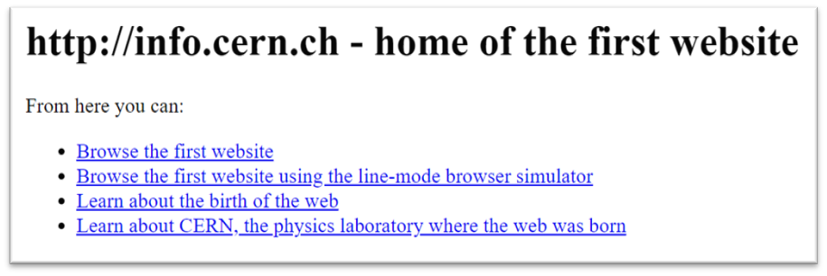
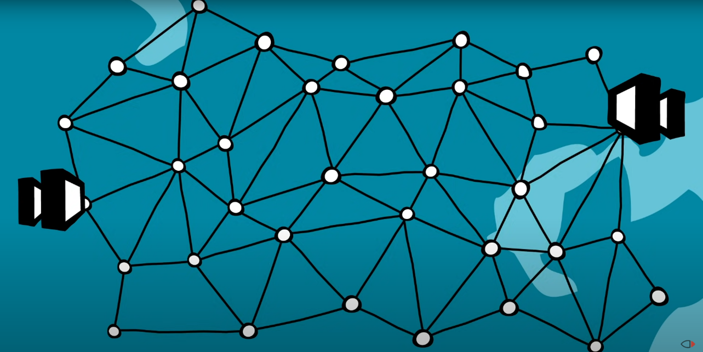
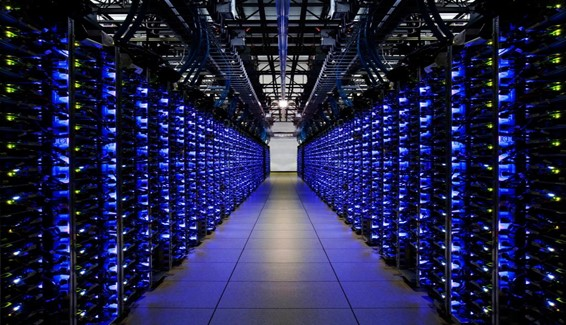

---
# Einführung in das Internet
---
# Geschichte des Internet

Die Geschichte des Internets kann man in drei Phasen unterscheiden.

Die erste Phase begann so etwa um 1964. Dort wurden die Grundlagen gelegt, die Technik demonstriert und die Anwendungsfähigkeit entwickelt. 

Der Vorläufer des Internet war das Arpanet. Es wurde im Auftrag des US-Verteidigungsministeriums entwickelt, um Universitäten miteinander zu verbinden. 1969 wurde das Netz der Öffentlichkeit vorgestellt, zu dem Zeitpunkt waren vier Computer der Universitäten Stanford, Los Angeles, Salt Lake Cirty und Santa Barbara in den USA miteinander verbunden.

1973 wurde das Internetprotokoll (TCP/IP) von Vinton Cerf und Robert Kahn entwickelt. Damit konnten Daten in kleinen Paketen übermittelt werden, was als Erfindung des Internets gilt. Der Begriff «Internet» stand für «Interconnected Networks». Das Protokoll ist heute noch in Verwendung. 

Ende der 1970er Jahre begann das Wachstum und die Internationale Ausbreitung des Internets.

1983 beschloss das US-Verteidigungsministerium, das Netz in ein öffentliches Advanced Research Projects Agency Network (ARPANET) und das vertrauliche MILNET aufzuteilen. Nur 45 der 113 Host-Rechner blieben im Arpanet übrig. Die Zahl der an diese Hosts angeschlossenen Rechner war viel größer, vor allem durch den Übergang von zeitlich geteilter Nutzung von Großrechnern (für die Benutzung hatte jeder ungefähr eine Stunde und musste dann wechseln) hin zu Workstations in einem LAN. Jon Postel war an der Entwicklung des Arpanet beteiligt und wies den einzelnen miteinander verbundenen Netzen Nummern (IP Adresse) zu.

Dann entwickelte er zusammen mit Paul Mockapetris und Craig Partridge das Domain Name System (DNS) welches gut lesbare Namen in IP Adressen übersetzt. Der erste Name-Server stand an der University of Wisconsin. Gleichzeitig empfahl Postel das heute übliche user@host.domain-Adressierungsschema. Das neue Adressensystem formalisiert sich 1988 mit Gründung der Internet Assigned Numbers Authority (IANA).

Auch in anderen Ländern wurden Netze aufgebaut, die mit dem Internet verbunden wurden. 1984 wurde zum Beispiel das JUNET (Japan Unix Network) etabliert. Für Aufregung sorgte die Nachricht von Kremvax. Womit angeblich die UdSSR an das Internet angeschlossen war - was sich aber als Aprilscherz herausstellte. 
Eines der ersten sozialen Netzwerke war 1985 „The WELL“. In sogenannten Foren konnten sich Menschen über verschiedene Themen austauschen. Analog zu „The WELL“ entstanden seit Mitte der 1980er-Jahre Mailboxnetze wie das FidoNet, Z-Netz und das MausNet sowie das CL-Netz, welches von politischen Aktivisten gegründet wurde. Ab 1992 wurden viele dieser Netze an das Internet angebunden und erlaubten preiswerte Mail- und News-Anbindung an das Internet.

1990 begann mit der Abschaltung des Arpanet die kommerzielle Phase des Internets. Es wird geschätzt, dass im Jahr 1993 das Internet lediglich 1 % der Informationsflüsse der weltweiten Telekommunikationsnetze ausmachte, während es sieben Jahre später im Jahr 2000 die Mehrheit des technischen Informationsaustausches beherrschte und im Jahr 2007 bereits klar dominierte.

Tim Berners-Lee, der britische Physiker und Informatiker gilt als Erfinder des World Wide Web, das er am 12. März 1989 bei CERN als Prinzip des "Hypertexts" vorschlug und am 12. November 1990 mit Robert Cailliau der Öffentlichkeit präsentierte und bis zum 20. Dezember 1990 mit der ersten Website der Welt unter der Adresse www.info.cern.ch vollendete. Die Seiten wurden in der Beschreibungsspracht HTML erstellt.

Im Laufe der Jahre sind 270 Millionen DNS-Domains mit ca. 1 Milliarden Sites erstellt worden.

# Wie Funktioniert das Internet?

Das Internet ist ein weltweites Netzwerk aus Computern und anderen Geräten, die miteinander verbunden sind und Daten austauschen können. Es ermöglicht es Menschen, miteinander zu kommunizieren, Informationen auszutauschen und Ressourcen zu teilen.

Das Internet funktioniert durch die Verwendung von Protokollen, die die Kommunikation zwischen Geräten regeln. Eines der wichtigsten Protokolle ist das Internet Protocol (IP), das die Übertragung von Datenpaketen zwischen Netzwerken ermöglicht.

Ein weiteres wichtiges Protokoll ist das Transmission Control Protocol (TCP), dass die sichere Übertragung von Daten zwischen Geräten gewährleistet, falls einmal Pakete verloren gehen.

Das Internet besteht aus Millionen von einzelnen Netzwerken, die miteinander verbunden sind und durch sogenannte Router gesteuert werden. Router sind Geräte, die Datenpakete von einem Netzwerk zum nächsten weiterleiten, indem sie die Ziel-IP-Adresse in jedem Paket lesen und entscheiden, welcher Weg am besten geeignet ist, um das Paket zu seinem Ziel zu bringen.

Um Daten im Internet über große Entfernungen zu verbreiten, gibt es schnelle Backbone-Netzwerke. In Deutschland sind die meisten Verbindungen über den Internetknoten in Frankfurt an das Backbone Netzwerk angeschlossen.

Das Netzwerk des Internet wird von verschiedenen Diensten genutzt. Ein paar bekannte Dienste wie Mail oder WWW (World Wide Web) kennt jeder.

Heute spricht man oft vom Internet, wenn man eigentlich das World Wide Web meint. Es basiert auf den Erfindungen aus dem Arpanet und von Tim Berners Lee.

Wenn man eine Website im World Wide Web öffnet, werden mehrere Prozesse ausgelöst, um die angeforderte Seite auf Ihrem Computer darzustellen. Hier ist eine kurze Erklärung darüber, wie dieser Prozess im Detail abläuft:
1.	Man gibt die URL (Standard für die Adressierung einer Website im World Wide Web) der gewünschten Website in Ihren Browser ein.
Zum Beispiel: „www.youtube.com“

2.	Der Browser sendet eine Anforderung an den DNS-Server (Domain Name System), um die IP-Adresse der Website zu erhalten.

3.	Der DNS-Server sucht die IP-Adresse der Website in seiner Datenbank und gibt sie an den Browser zurück.

4.	Der Browser sendet dann eine Anforderung an den Webserver (mit dem Protokoll http oder https), auf dem die Website gehostet wird, mithilfe der erhaltenen IP-Adresse.

5.	Der Webserver empfängt die Anforderung und sucht die gewünschte Seite.

6.	Der Webserver sendet dann die gewünschte Seite zurück an den Browser, zusammen mit Informationen über die verwendeten Ressourcen wie Bilder, CSS-Dateien und Skripte. Die Seite verwendet meistens HTML zur Beschreibung der Inhalte.

7.	Der Browser empfängt die Seite und stellt sie auf Ihrem Computer dar.

8.	Während der Browser die Seite darstellt, sendet er manchmal auch Anforderungen an andere Server, um Ressourcen wie Bilder und Skripte zu laden.

9.	Dann ist die Website fertig und man kann sie anschauen. Wenn man auf einen Link in der Website klickt, geht der Prozess von vorne los.

Dieser Prozess läuft in Millisekunden ab, und der Dienst WWW verwendet dabei diverse Protokolle (TCP, IP, HTTP, HTTPS...) die dafür sorgen, dass die Daten sicher und zuverlässig übertragen werden.

# Wo Wohnt das Internet?
Das Internet ist heute ein globaler Netzwerkverbund aus Computern, die miteinander verbunden sind und Daten austauschen können. 

Netzwerke und Routing ermöglichen die Verbindung von Computern und die Übertragung von Daten zwischen ihnen. Eine IP-Adresse ist eine eindeutige – aus vier Zahlen bestehende - Nummer, die jedem Gerät im Internet zugewiesen wird, um es eindeutig identifizieren und kommunizieren zu können.

Ein Server ist ein Computer oder ein Computerprogramm, das Dienste für andere Computer bereitstellt. 
Heute dienen meistens Rechenzentren als Standorte für diese Server und andere Computer-Ausrüstungen, um die Verarbeitungs- und Speicherkapazität des Internets zu erhöhen. 

Weil Server besonders geschützt werden sollen und viel Energie verbrauchen, ist es sinnvoll, sie in Rechenzentren zu betreiben. Hier können auch sehr schnelle Netze angeschlossen werden, das wäre zu teuer, wenn die Rechner sehr verteilt stehen würden. Wichtig ist auch eine gute Kühlung der Server.

Was die Server betrifft, so gibt es heute viele Rechenzentren (Weltweit über 7.500 Rechenzentren, und in Deutschland über 3.000) mit viel schnelleren Servern (Es gibt schon ca.12 Millionen Server, die mit dem Internet verbunden sind), die eine viel größere Kapazität und Leistung haben als früher.

Mittlerweile gibt es auch sehr große Anbieter von Diensten im Internet, sogenannte Cloud-Anbieter. Zu denen gehören zum Beispiel Google, Microsoft und Amazon Web Services.

Diese Cloud-Anbieter haben hunderte von Rechenzentren mit Millionen von Servern. Die meisten Websites laufen heute in einem dieser Rechenzentren. In Europa gibt es auch solche großen Server-Betreiber, zum Beispiel die Firma IONOS.

# Wie sieht das Internet heute aus?
Das Internet hat sich in den letzten Jahrzehnten stark weiterentwickelt.

Zum einen ist es größer geworden: Im Laufe der Jahre sind 270 Millionen Domains und ca. 1 Milliarde Sites erstellt worden.
Im Vergleich zu früher gibt es heute viel mehr Nutzer (mehr als 5.3 Milliarden) und viel mehr Inhalte als früher. Aber auch die Geschwindigkeit des Internets ist deutlich schneller geworden. Mittlerweile können nicht nur Texte sondern auch Videos und andere sehr große Dateien übertragen werden.

Das Internet hat auch die Art und Weise, wie Unternehmen arbeiten und Geschäfte machen, grundlegend verändert. E-Commerce und Online-Geschäfte haben es Unternehmen ermöglicht, ihre Produkte und Dienstleistungen weltweit anzubieten und zu verkaufen. Online-Marketing und Werbung ermöglichen es Unternehmen, ihre Zielgruppe besser zu erreichen und ihre Produkte und Dienstleistungen effektiver zu bewerben.

Durch das Internet hat sich auch das Arbeiten und Lernen von uns Menschen verändert. Remote-Arbeit und Online-Kurse sind heute weit verbreitet und ermöglichen es Menschen, von überall auf der Welt aus zu arbeiten und zu lernen.

Allerdings gibt es auch Herausforderungen, die mit dem Internet einhergehen. Datenschutz- und Sicherheitsprobleme sind von großer Bedeutung, da immer mehr persönliche und finanzielle Informationen online gespeichert werden. Es gibt auch Probleme mit Online-Betrug und Cyberkriminalität.
Es ist wichtig, dass Internetnutzer ihre persönlichen Daten schützen und sich über die Risiken im Internet im Klaren sind.

Die Internetseiten sind heute oft mit viel mehr Funktionen ausgestattet und benutzerfreundlicher und es gibt viel mehr Möglichkeiten, Inhalte zu teilen und zu konsumieren.

Auch mit der Verbreitung von Smartphones und Tablets hat sich die Art und Weise, wie wir das Internet nutzen, stark verändert. Heute werden viele Websites und Anwendungen speziell für die Nutzung auf mobilen Geräten optimiert.

Bei der Entwicklung des Internets ist die zunehmende Verbreitung von schnellen Breitband-Internetverbindungen ebenfalls höher. Dies hat die Nutzung von Inhalten wie Videos und Online-Spielen deutlich erleichtert. 

Ein anderer wichtiger Faktor ist die zunehmende Verbreitung des sogenannten Cloud-Computing. Dies ermöglicht es Unternehmen und Einzelpersonen, ihre Daten und Anwendungen in Rechenzentren zu speichern und von überall auf der Welt darauf zuzugreifen.

Social Media hat auch das Internet stark verändert, indem es die Kommunikation und den Austausch von Informationen deutlich erleichtert hat. Allein ein Dienst wie Instagram hat heute über 1 Milliarde Benutzer auf der Welt. YouTube hat sogar 2,3 Milliarden Benutzer.

Neueste Erweiterung bei der Internetentwicklung ist die zunehmende Verbreitung von künstlicher Intelligenz und maschinellem Lernen. Diese Technologien werden verwendet, um Inhalte besser personalisieren und die Suchergebnisse im Internet verbessern zu können. Sie ermöglichen es außerdem Unternehmen, ihre Geschäftsprozesse zu automatisieren.

Die Verbreitung von Sicherheitsmaßnahmen wie Firewalls und Verschlüsselungstechnologien hat sich ebenfalls verbessert, um die Sicherheit von Online-Transaktionen und Daten zu gewährleisten.
Ein neuer Trend ist die Entstehung des "Internet of Things" (IoT), bei dem Gegenstände und kleine Geräte miteinander vernetzt sind und sich gegenseitig Daten übertragen können.

Dies ermöglicht es Unternehmen, ihre Produkte und Dienstleistungen zu verbessern und neue Geschäftsmodelle zu entwickeln. In der Zukunft erwartet man, dass durch die Verbreitung von 5G (ein Mobilfunkstandard) und Edge-Computing die Internetgeschwindigkeit und Verfügbarkeit weiter erhöht werden.

Durch technischen Fortschritt gibt es also immer wieder neue Anwendungen für das Internet. Die eigentlichen Technologien stammen aber immer noch aus den Anfangszeiten des Arpanet und von Tim Berners Lee.

# Abkürzungsverzeichnis

Abkürzung | Erklärung
--------|-----
URL|Uniform Resource Locator
ARPANet|Advanced Research Projects Agency Network
TCP|Transmission Control Protocol
IP|Internet Protocol
http / https|Hypertext Transfer Protocol/ Hypertext Transfer Protocol Secure
DNS|Domain Name System
IoT|Internet of Things
UUcp|Unix to Unix Copy Protocol
JUNET|Japan Unix Network
MILNET|Militärisches Netzwerk
LAN|Local Area Network
HTML|Hypertext Markup Language

# Quellenverzeichnis

-	Tim Bernes-Lee Infos 
[https://whoswho.de/bio/tim-berners-lee.html](https://whoswho.de/bio/tim-berners-lee.html)  
Abgerufen am 27.1.2023 16:30

-	Geschichte des Internets  [https://de.wikipedia.org/wiki/Geschichte_des_Internets](https://de.wikipedia.org/wiki/Geschichte_des_Internets)  
Abgerufen am 22.1.2023 18:30

-	Internet-Informationen  
[https://de.wikipedia.org/wiki/Internet](https://de.wikipedia.org/wiki/Internet) 
Abgerufen am 27.1.2023 17:30

-	Wie funktioniert das Internet 
[https://www.cloudflare.com/de-de/learning/network-layer/how-does-the-internet-work/](https://www.cloudflare.com/de-de/learning/network-layer/how-does-the-internet-work/) 
Abgerufen am 28.1.2023 16:00 

-	Was passiert beim Aufrufen einer Website 
[https://www.ionos.de/digitalguide/websites/web-entwicklung/was-passiert-beim-webseitenaufruf/](https://www.ionos.de/digitalguide/websites/web-entwicklung/was-passiert-beim-webseitenaufruf/) 
Abgerufen am 25.1.2023 17:30 

-	Wie hat sich das Internet verändert 
[https://www.fairrank.de/blog/1969-2019-wie-sich-das-internet-veraendert-hat/](https://www.fairrank.de/blog/1969-2019-wie-sich-das-internet-veraendert-hat/) 
Abgerufen am 26.1.2023 18:00 

-	Anzahl der Server im Internet  [https://news.netcraft.com/archives/2023/01/27/january-2023-web-server-survey.html](https://news.netcraft.com/archives/2023/01/27/january-2023-web-server-survey.html) 
 Abgerufen am 29.1.2023 15:20 

-	3 Säulen des Internets  
[https://www.einfache-internetseiten.de/kurze-geschichte-des-internets/](https://www.einfache-internetseiten.de/kurze-geschichte-des-internets/) 
Abgerufen am 29.1.2023 16:00 

-	Netz der Server  
[https://www.youtube.com/watch?v=uIZh2v7YpP4](https://www.youtube.com/watch?v=uIZh2v7YpP4) 
Abgerufen am 29.1.2023 19:30 

-	Eine kurze Geschichte des Internets 
[https://blog.hubspot.de/marketing/geschichte-des-internets](https://blog.hubspot.de/marketing/geschichte-des-internets) 
Abgerufen am 27.1.2023 17:00 
